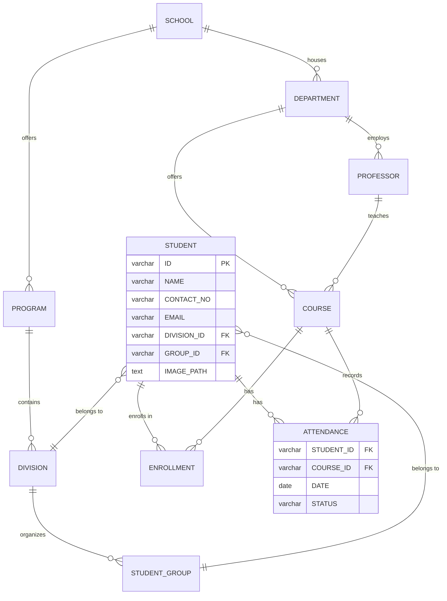

<div align="center">

# 👤 Face Recognition Attendance System

**Students look at a webcam and they're marked present: no roll call, no proxy sign-ins.**

A DBMS course project. It pairs a normalised university schema (schools → programs → divisions → groups → students, courses, enrollments) with real-time face recognition that writes attendance straight to MySQL.


</div>

---

## ✨ What it does

- 🎥 **Live recognition**: reads the webcam, matches faces against every student photo in the database with `face_recognition` (dlib, 128-d embeddings) and draws the name on screen.
- 🗄️ **Writes to MySQL**: marks `PRESENT` in `ATTENDANCE` for the given course and date. `INSERT IGNORE` keeps one record per student/course/day.
- 🏫 **Full university schema**: 10 related tables with keys and constraints, plus realistic seed scripts for several departments.
- 🖥️ **Desktop prototype**: a CustomTkinter app (`attendance_system/`) with a live camera panel, start/stop and today's list, backed by SQLite.
- 🔐 **Auth API**: Flask + JWT endpoints to register and log in students (`app.py`).

---

## 🗄️ Database design



The full ER diagram with every attribute is in [`ER Diagram.png`](ER%20Diagram.png). The schema is in [`V1_till structure/schema structure2.sql`](V1_till%20structure/schema%20structure2.sql), and example reports (attendance %, defaulters, per-course summaries) are in [`sample_queries.sql`](V1_till%20structure/sample_queries.sql).

---

## 🚀 Getting started

### 1. Install

```bash
git clone https://github.com/ChetanGadhiya017/face-based-attendance-system.git
cd face-based-attendance-system
python -m venv .venv && .venv\Scripts\activate      # macOS/Linux: source .venv/bin/activate
pip install -r requirements.txt
```

> `face_recognition` depends on **dlib**. On Windows, install [CMake](https://cmake.org/download/) and the *Desktop development with C++* workload of Visual Studio Build Tools first.

### 2. Create the database

```sql
CREATE DATABASE attendance_v1;
USE attendance_v1;
SOURCE "V1_till structure/schema structure2.sql";
-- then the seed files: school.sql, program.sql, department.sql, division.sql, group.sql,
-- insert_students.sql, ins_course.sql, ins_enroll_check.sql …
```

Make sure each student's `IMAGE_PATH` points to a clear, front-facing photo.

### 3. Configure

```bash
cp .env.example .env     # set ATTENDANCE_DATABASE_URL (and DB_* / JWT_SECRET_KEY for app.py)
```

### 4. Take attendance

```bash
python face.py 20CP210P                 # today's attendance for course 20CP210P
python face.py 20CP210P --date 2025-04-25
```

Press **q** to stop.

### Optional

```bash
python attendance_system/main.py        # desktop prototype (SQLite, photos in attendance_system/images/)
python app.py                           # auth API: POST /register, POST /login, GET /student (JWT)
```

---

## 🗂️ Project structure

```
├── face.py                     # webcam recognition → MySQL attendance (main entry point)
├── app.py                      # Flask + JWT student auth API
├── attendance_system/          # CustomTkinter desktop prototype (SQLite) and earlier iterations
├── V1_till structure/          # MySQL schema, seed data, sample queries
├── ER Diagram*.png, *.drawio, ermodelv1.mwb   # ER models (draw.io / MySQL Workbench)
├── requirements.txt
└── .env.example
```

---

## 🔮 Future work

- Timetable-aware sessions: attendance is only accepted during the scheduled lecture
- Instant summary to the faculty member after each lecture
- Liveness detection so a printed photo can't be used
- Web dashboard for students, faculty and admins

---

## 🤝 Contributors

<table>
  <tr>
    <td align="center"><a href="https://github.com/ChetanGadhiya017"><br/><sub><b>Chetan Gadhiya</b></sub></a></td>
    <td align="center"><a href="https://github.com/VedeshP"><br/><sub><b>Vedesh Pandya</b></sub></a></td>
  </tr>
</table>
